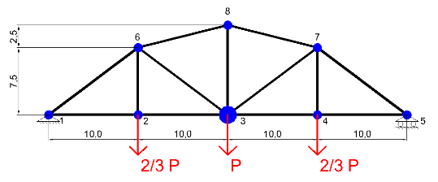

# Mecanica del continuo
### Trabajo practico Nro 1

- Desarrolle un programa de computación que calcule la respuesta dinámica del sistema a
una carga definida por una función uniforme en el tiempo P(t), en un periodo de tiempo
de 0 a 50 seg (tF). Realizar una animación de la respuesta de la estructura. Obtenga una
gráfica de evolución del esfuerzo de la barra a y de la coordenada actual del nodo b,
indicados en cada caso. Determine el desplazamiento máximo y cuando se produce, de
todos los nodos y para todo el periodo indicado.

- Modifique el programa desarrollado para calcular la respuesta del sistema a una carga
donde P(t) tiene variación sinusoidal. Experimente y grafique algunos resultados
convenientes para el análisis, considerando excitaciones de diferentes frecuencias.
Extraiga conclusiones

---

#### Datos

- P(t) = 1
- a = 2
- b = 3

| Nodo | Masa  |
|-----|-----|
| 1    | 1  |
| 2    | 1  |
| 3    | 2  |
| 4    | 1  |
| 5    | 1  |
| 6    | 1  |
| 7    | 1  |
| 8    | 1  |

| Barra | Ni | Nj | Rigidez |
|---|---|---|---|
| 1     | 1  | 2  | 2 |
| 2     | 3  | 8  | 4 |
| 3     | 2  | 6  | 2 |
| 4     | 6  | 1  | 2 |
| 5     | 6  | 8  | 2 |
| 6     | 6  | 3  | 4 |
| 7     | 2  | 3  | 2 |
| 8     | 5  | 4  | 2 |
| 9     | 4  | 7  | 2 |
| 10    | 7  | 5  | 2 |
| 11    | 7  | 8  | 2 |
| 12    | 7  | 3  | 4 |
| 13    | 4  | 3  | 2 |

### gif reticulado con fuerza uniforme

